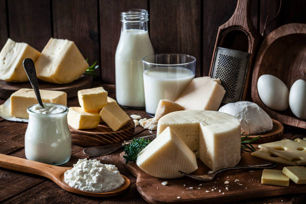

> Fullstack Dairy Products Application using Reactjs
> [follow Us] (https://codewithshankar.web.app)



# To check the node version

```
node --version
```

# To initialize the Firbase console

```
firebase init
```

# To start the server

```
npm run server
```

# To create react project using nmp & yarn

```
nmp create-react-app folder_name
```

```
yarn create-react-app folder_name
```

# To start the client

```
yarn start
```
